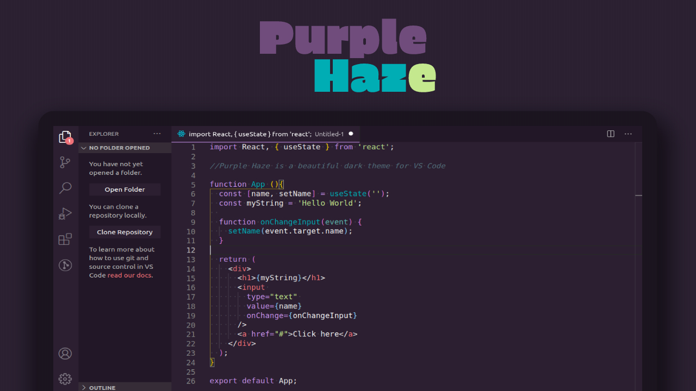

# Purple Haze

## About
Purple Haze is a beautiful dark theme for Visual Studio Code. 

## Install

1.  Press Ctrl+Shift+P
2.  Then enter Install Extension
3.  Write **Purple Haze Theme**
4.  Select it or press Enter to install.

## Activating theme
Run Visual Studio Code. The **Purple Haze Theme** will be available from File -> Preferences -> Color Theme dropdown menu.

## License
Please be aware of the licenses of the components we use in this project. Everything else that has been developed by the contributions to this project is under [MIT License](https://github.com/fmm312/purple-haze/blob/master/LICENSE)
